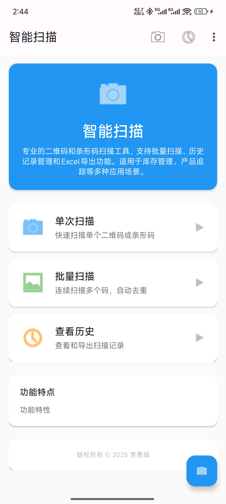
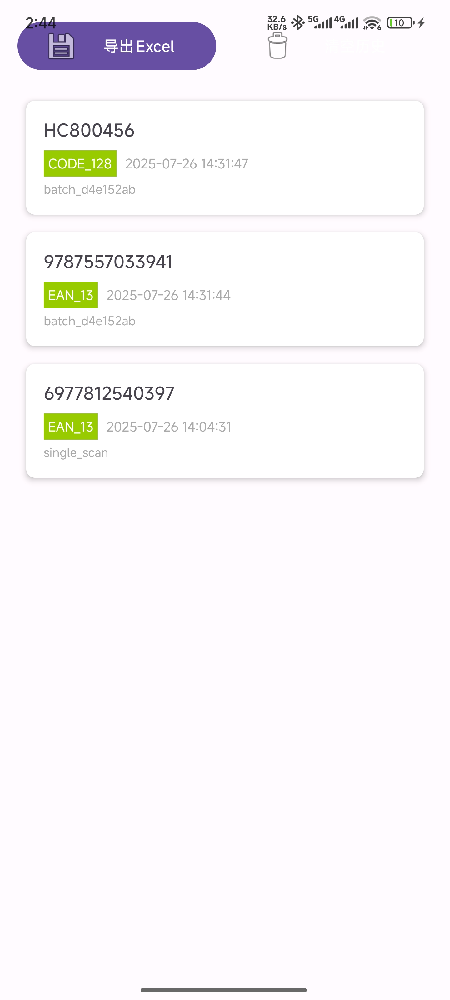

# SmartScan

[English](README.md) | 简体中文

一个功能强大的 Android 二维码/条形码扫描应用，支持批量扫描、历史记录管理和数据导出功能。

## 📥 下载安装

### 最新版本: v1.0.0

[](https://github.com/liyongcheng94/SmartScan/releases/tag/v1.0.0)
[](https://github.com/liyongcheng94/SmartScan/releases/tag/v1.0.0)
[](LICENSE)
[](https://developer.android.com)
[](https://developer.android.com/guide/topics/manifest/uses-sdk-element)

**🚀 直接下载**: [SmartScan v1.0.0 APK](https://github.com/liyongcheng94/SmartScan/releases/tag/v1.0.0)

### 📱 安装说明

1. 从 [Releases 页面](https://github.com/liyongcheng94/SmartScan/releases/tag/v1.0.0) 下载最新版本的 APK 文件
2. 在 Android 设备上启用"未知来源"应用安装权限
3. 打开下载的 APK 文件进行安装
4. 首次启动时授予摄像头权限以开始使用扫描功能

### ⚡ 快速体验

安装完成后，您可以立即体验以下功能：

- 📷 打开应用即可开始扫描二维码
- 📊 尝试批量扫描模式
- 📋 查看扫描历史记录
- 📤 导出扫描结果为 Excel 文件
- 🔒 完全离线使用，无需担心隐私泄露

## 功能特性

### 📱 核心功能

- **实时扫描**：支持二维码和条形码的实时扫描识别
- **批量扫描**：一次性扫描多个码，提高工作效率
- **历史记录**：自动保存扫描记录，便于查看和管理
- **数据导出**：支持将扫描结果导出为 Excel 文件

### 🛠️ 技术特性

- **高精度识别**：采用先进的图像识别算法
- **快速响应**：优化的扫描引擎，识别速度快
- **用户友好**：简洁直观的用户界面
- **数据安全**：本地存储，保护用户隐私
- **离线运行**：无需联网权限，完全离线操作，杜绝信息泄露

## 应用截图

<div align="center">

### 首页界面



### 扫描历史



</div>

## 系统要求

- **Android 版本**：Android 8.0 (API Level 26) 及以上
- **目标版本**：Android 14 (API Level 36)
- **权限要求**：
  - 摄像头权限 (必需)
  - 存储权限 (用于导出文件)

## 主要功能模块

### 1. 扫描功能

- 支持多种码制：QR 码、Code128、Code39、EAN-13 等
- 实时预览和自动对焦
- 扫描结果即时显示

### 2. 批量扫描

- 连续扫描模式
- 批量结果管理
- 一键导出所有结果

### 3. 历史记录

- 扫描记录自动保存
- 按时间排序查看
- 支持搜索和筛选
- 记录详情查看

### 4. 数据导出

- Excel 格式导出
- 自定义文件名
- 支持分享功能

## 技术栈

- **开发语言**：Java
- **最低 SDK**：API Level 26 (Android 8.0)
- **目标 SDK**：API Level 36 (Android 14)
- **构建工具**：Gradle Kotlin DSL
- **依赖管理**：Version Catalog
- **UI 框架**：Android View System + ViewBinding

## 项目结构

```
SmartScan/
├── app/
│   ├── src/
│   │   ├── main/
│   │   │   ├── java/com/willli/smart_scan/
│   │   │   │   ├── MainActivity.java          # 主界面
│   │   │   │   ├── ScanActivity.java          # 扫描界面
│   │   │   │   ├── HistoryActivity.java       # 历史记录
│   │   │   │   └── BatchScanActivity.java     # 批量扫描
│   │   │   ├── res/                           # 资源文件
│   │   │   └── AndroidManifest.xml           # 应用配置
│   │   ├── androidTest/                       # 集成测试
│   │   └── test/                              # 单元测试
│   └── build.gradle.kts                       # 模块构建配置
├── gradle/
│   └── libs.versions.toml                     # 依赖版本管理
├── images/                                    # 应用截图
├── build.gradle.kts                          # 项目构建配置
├── settings.gradle.kts                       # 项目设置
└── README.md                                 # 项目说明
```

## 开始使用

### 📱 普通用户

如果您只是想使用 SmartScan 应用，请直接：

1. 前往 [Releases 页面](https://github.com/liyongcheng94/SmartScan/releases/tag/v1.0.0) 下载最新版本 APK
2. 在 Android 设备上安装并使用

### 👨‍💻 开发者

如果您想参与开发或自行构建，请按以下步骤操作：

#### 环境准备

1. Android Studio Arctic Fox 或更高版本
2. JDK 11 或更高版本
3. Android SDK API Level 36

#### 构建步骤

1. 克隆项目到本地

   ```bash
   git clone https://github.com/liyongcheng94/SmartScan.git
   ```

2. 使用 Android Studio 打开项目

3. 同步 Gradle 依赖

   ```bash
   ./gradlew build
   ```

4. 连接 Android 设备或启动模拟器

5. 点击运行按钮或使用命令行
   ```bash
   ./gradlew installDebug
   ```

## 权限说明

应用需要以下权限才能正常工作：

- **CAMERA**：用于扫描二维码/条形码
- **WRITE_EXTERNAL_STORAGE**：用于导出 Excel 文件（Android 12 及以下）
- **READ_EXTERNAL_STORAGE**：用于读取文件（Android 12 及以下）
- **READ_MEDIA_IMAGES/VIDEO/AUDIO**：用于访问媒体文件（Android 13+）
- **MANAGE_EXTERNAL_STORAGE**：用于管理外部存储（可选）

### 🔒 隐私保护

- **无网络权限**：应用不申请任何网络相关权限，完全离线运行
- **数据不上传**：所有扫描数据仅保存在本地设备，绝不上传到服务器
- **隐私安全**：杜绝信息泄露，保护用户扫描内容的隐私安全

## 版本信息

- **当前版本**：v1.0.0
- **版本代码**：1
- **发布日期**：2025 年 7 月 26 日
- **APK 大小**：约 13.3 MB
- **支持架构**：armeabi-v7a, arm64-v8a, x86, x86_64

### 版本历史

#### v1.0.0 (2025-07-26)

- ✨ 首次正式发布
- 📱 支持实时二维码/条形码扫描
- 📊 批量扫描功能
- 📋 扫描历史记录管理
- 📤 Excel 格式数据导出
- 🔒 本地数据存储，保护隐私

## 贡献指南

欢迎提交 Issue 和 Pull Request 来帮助改进项目：

1. Fork 项目
2. 创建功能分支 (`git checkout -b feature/AmazingFeature`)
3. 提交更改 (`git commit -m 'Add some AmazingFeature'`)
4. 推送到分支 (`git push origin feature/AmazingFeature`)
5. 创建 Pull Request

## 许可证

本项目采用 MIT 许可证 - 查看 [LICENSE](LICENSE) 文件了解详情

## 联系方式

如有问题或建议，请通过以下方式联系：

- 项目 Issues：[GitHub Issues](https://github.com/liyongcheng94/SmartScan/issues)
- 邮箱：1558139110@qq.com

---

**Made with ❤️ by [liyongcheng94]**
